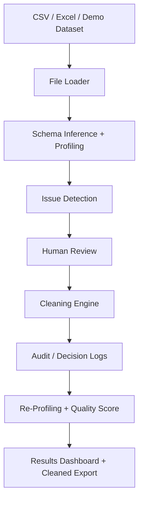

# Data Quality Agent

**Human-in-the-loop data profiling and cleaning for CSV and Excel files.**

A Streamlit application that profiles unfamiliar datasets, detects data-quality issues,
recommends context-aware cleaning strategies, and applies only user-approved changes. It
includes before/after quality scoring, audit logging, interactive results, and cleaned
CSV/Excel export. Upload your own file, or explore instantly with the bundled demo
dataset.

```
01 Upload  →  02 Review Issues  →  03 Clean Data  →  04 Results
```

[View Project](https://nofar136.github.io/data-quality-agent/) · [Live Demo](https://data-quality-agent-nsfyrz2uznzsrhgnx6dddv.streamlit.app)

## Key Features

- CSV/Excel ingestion with encoding and delimiter detection
- Logical type inference and column profiling
- Rule-based data quality issue detection
- Human confirmation/override of uncertain column types
- Context-aware cleaning strategies (e.g. Median / Mean / Mode / Custom / Keep NULL for missing values)
- Preview before any change is applied
- Audit log and separate cleaning decision log
- Before/after quality scoring with an interactive dashboard
- Cleaned CSV/Excel export
- Bundled demo dataset for instant exploration
- 265 automated tests passing

Rule-based and fully explainable; no external AI API is required at runtime.

## Demo Dataset

Bundled **Messy Employee Dataset** (`data/demo_employee_data.csv`) — 1,020 rows × 12
columns of synthetic HR data with intentional missing values, mixed date formats, and
other type/formatting issues.

- Source: [Messy Employee Dataset](https://www.kaggle.com/datasets/desolution01/messy-employee-dataset) by Aanuoluwapo John Shodipo, via Kaggle
- License: CC0 1.0 Universal (Public Domain)

## Tech Stack

Python · Streamlit · Pandas · NumPy · Plotly · SQLite · OpenPyXL · Pytest

## Architecture



## Run Locally

```bash
python -m venv .venv
```

```bash
# Windows
.venv\Scripts\activate

# macOS / Linux
source .venv/bin/activate
```

```bash
pip install -r requirements.txt
streamlit run app.py
```

## Live Demo

- Live Demo: [https://data-quality-agent-nsfyrz2uznzsrhgnx6dddv.streamlit.app](https://data-quality-agent-nsfyrz2uznzsrhgnx6dddv.streamlit.app)
- Project Page: [https://nofar136.github.io/data-quality-agent/](https://nofar136.github.io/data-quality-agent/)

## License / Dataset Attribution

Demo dataset (`data/demo_employee_data.csv`): CC0 1.0 Universal (Public Domain) — see
[Demo Dataset](#demo-dataset) above for source.

No software license has been selected yet for this project's own source code.
