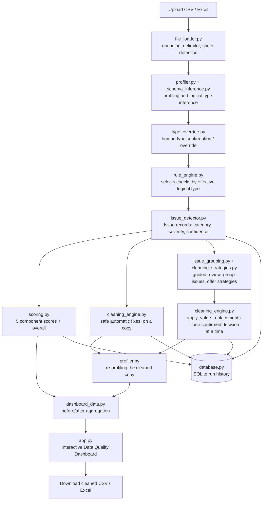

# Architecture

## Pipeline overview

Every arrow is a plain Python function call operating on a pandas DataFrame or a list of
dataclasses -- there is no message queue, no background worker, and no external service.
The application is a single Streamlit process; SQLite is a local file, not a server.

The workflow in words: **Upload -> Profiling -> Type Inference -> Human Type
Confirmation/Override -> Issue Detection -> Safe Automatic Fixes -> Guided Issue Review
(one issue group at a time: strategy -> preview -> apply) -> Re-Profiling -> Quality
Dashboard -> Clean Dataset Download.** Guided review loops back into re-detection after
every applied decision, since each change can resolve some issues and re-profiling can
reveal others.

## Module responsibilities

| Module | Responsibility | Depends on |
|---|---|---|
| `file_loader.py` | Turn an uploaded file into a DataFrame + parsing metadata, never crashing on malformed input | pandas, chardet |
| `schema_inference.py` | Infer each column's logical type from its values (not its name or dtype) | pandas, numpy |
| `profiler.py` | Compute per-column statistics appropriate to its logical type | `schema_inference` |
| `type_override.py` | Let the user confirm or override a column's effective logical type for the session, without touching raw data | `profiler`, `schema_inference` |
| `rule_engine.py` | Decide which issue checks apply to which column, based on its *effective* logical type | `schema_inference`, `issue_detector` |
| `issue_detector.py` | Implement each individual check; return `Issue` records | `profiler`, `schema_inference` |
| `cleaning_engine.py` | Apply safe, automatic fixes to a copy of the data; also `apply_value_replacements`, the one generic executor behind every confirmed guided-cleaning decision; log every change | `schema_inference`, `models` |
| `cleaning_strategies.py` | The Cleaning Strategy Engine: pure decision functions that, given an effective logical type + issue type + the column's current values, return only the remediation strategies that make sense -- never mutates a DataFrame, never decides *which* strategy to use | `schema_inference`, `profiler`, `config` |
| `issue_grouping.py` | Groups detected issues into (column, issue type) guided-review units, for only the issue types the Strategy Engine covers | `models`, `profiler` |
| `scoring.py` | Aggregate `Issue` records into five component scores + an overall score | `models`, `config` |
| `dashboard_data.py` | Pure before/after data prep (KPIs, category/severity/column comparisons) for the dashboard | `models`, `scoring` |
| `database.py` | Persist a run (profiles, issues, audit log, scores) to SQLite; load history | `models`, `profiler`, `scoring` |
| `app.py` | Streamlit presentation layer: sidebar navigation, forms, tables, interactive charts, and the guided-review UI (strategy selection, preview, apply) -- delegates all business logic to `cleaning_strategies.py`/`cleaning_engine.py`/`issue_grouping.py` | everything above |
| `config.py` | Every threshold, weight, path, and filename constant, in one place | (none) |
| `models.py` | Shared dataclasses (`Issue`, `AuditLogEntry`, `CleaningDecisionLogEntry`) used across modules | (none) |

## Human-in-the-loop type override

`schema_inference.py` always infers a logical type and a confidence score, but inference
is heuristic and can be wrong -- especially on ambiguous or low-confidence columns. The
Column Profiling page shows the detected type and confidence for the selected column and
lets the user confirm it or pick a different one from a small, coarse set (Numeric,
Categorical, Text, Date/Datetime, Boolean, Identifier, or Unknown). Confidence below
`TYPE_OVERRIDE_CONFIDENCE_WARNING_THRESHOLD` (`config.py`) triggers an explicit warning
to review the column before relying on it.

The override never modifies the raw data or the original inference (`ColumnProfile.
logical_type`/`confidence`/`evidence` are untouched) -- it only sets a new
`effective_logical_type` field, which `rule_engine.py` and `issue_detector.py` use
instead of the raw inferred type. Every decision (confirm or change) is appended to an
in-session audit log (`type_override_log`), visible on the Column Profiling page.

## Guided cleaning workflow (Phase 7B)

The Data Cleaning page has two steps. Step 1 is unchanged from Phase 4/6: a fixed
pipeline of always-safe fixes. Step 2 is the guided workflow:

1. `issue_grouping.build_issue_groups` buckets the current working copy's detected
   issues by `(column, issue_type)`, keeping only the issue types the Strategy Engine
   covers (`GUIDED_REVIEW_ISSUE_TYPES`: missing values, outliers, negative values, and
   the two category-variant types). Everything else stays visible only on the Data
   Quality Issues page.
2. For the group the user picks, `cleaning_strategies.get_*_strategies` returns the
   candidate `CleaningStrategyOption`s for that group's *effective* logical type (after
   any Column Profiling override) and, where relevant, display statistics (mean,
   median, IQR bounds, mode) computed from the column's current values -- never a
   fabricated number, and never offered if it can't be safely computed.
3. `app.py` renders the strategy dropdown, an optional scope selector (all affected
   rows vs. a hand-picked subset, capped at `MAX_SAMPLE_ROWS_TO_INSPECT` so the UI never
   lists thousands of rows at once), and a preview -- current value, proposed value,
   and counts -- entirely from data already in memory. No function here mutates
   anything; selecting a strategy or scope is just a Streamlit widget value.
4. Only the explicit "Apply Cleaning Decision" button calls
   `cleaning_engine.apply_value_replacements` (if the strategy changes data) and appends
   one `CleaningDecisionLogEntry` (always, even for "Keep as NULL" / "Do not clean" /
   "Keep outlier(s)" / "Negative values are valid" / "Keep all variants", which change
   nothing). The session's `CleaningResult` is updated and the page reruns, so the next
   render re-detects issues against the new working copy -- a group shrinks or
   disappears once its underlying values actually change.

This keeps a strict separation of concerns: `cleaning_strategies.py` decides *what's
possible*, `app.py` only renders choices and never contains a strategy rule itself,
and `cleaning_engine.py` is the only place a DataFrame is ever actually mutated.

## ETL framing

Although this is an interactive app rather than a batch pipeline, the same data flows
through a classic **Extract -> Transform -> Load** shape:

- **Extract**: `file_loader.py` reads an arbitrary CSV/Excel file into a DataFrame,
  handling encoding/delimiter/sheet ambiguity so the rest of the pipeline can assume a
  clean, well-formed DataFrame going in.
- **Transform**: `schema_inference.py` -> `profiler.py` -> `type_override.py` ->
  `rule_engine.py` -> `issue_detector.py` -> `scoring.py` progressively derive structure
  (logical types, confirmed or corrected by the user), statistics (profiles), findings
  (issues), and a judgment (scores) from that DataFrame, entirely in memory, with no
  side effects. `cleaning_engine.py` is the one step that produces a new DataFrame (a
  cleaned copy) rather than just derived metadata, which is then re-profiled and
  re-scored the same way as the original.
- **Load**: `database.py` writes the derived artifacts -- profiles, issues, audit log,
  scores -- into normalized SQLite tables, so run history persists across sessions. The
  *dataset itself* is deliberately never "loaded" anywhere beyond the cleaned file the
  user downloads directly -- only what the pipeline learned about it is persisted.

## Why no external AI/LLM API

Every decision in this pipeline -- which logical type a column has, which checks apply,
how severe an issue is, what the quality score is -- comes from an explicit, inspectable
rule in `config.py` or a deterministic function in `src/`. There is no model call, no
prompt, and no non-determinism: the same file (and the same type overrides) produces the
same output every time, and every output can be traced back to the specific rule that
produced it. This is a design choice, not a limitation worked around -- it's what makes
the tool auditable enough to trust with someone else's data. Where a decision is
genuinely domain-specific or ambiguous (an uncertain column type, whether an outlier is
really an error), the tool surfaces it and asks -- it does not guess.
